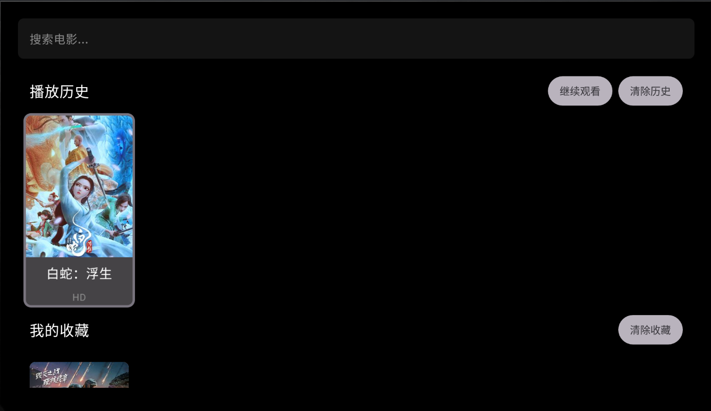
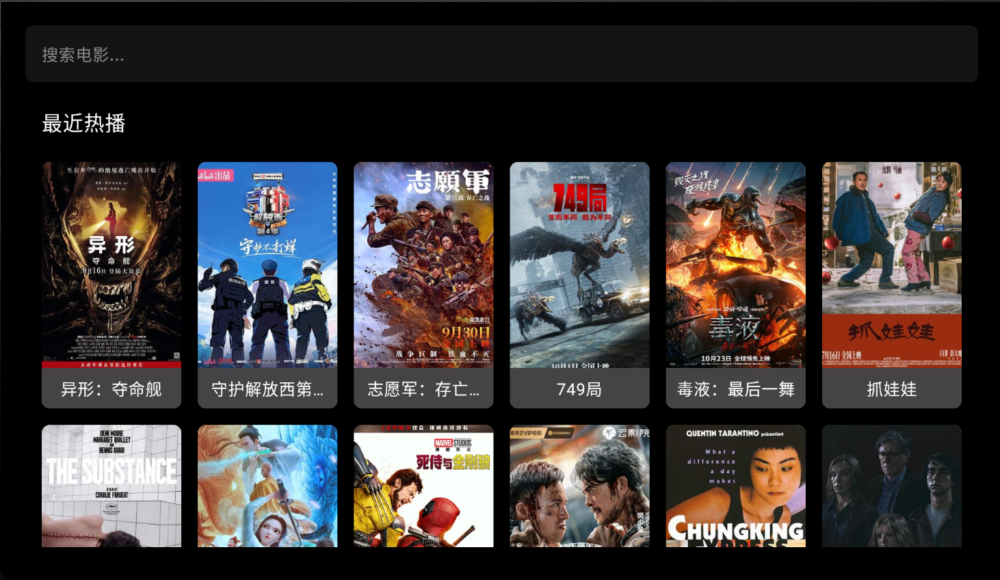
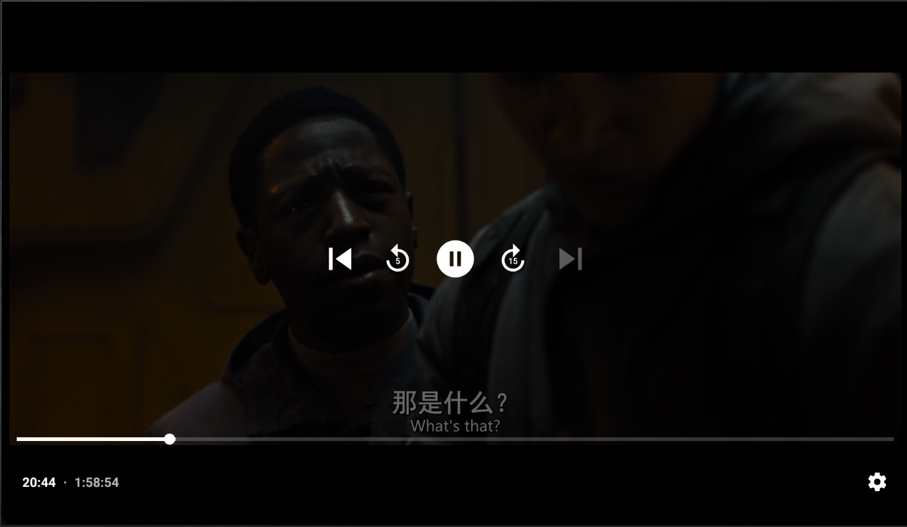

# 简片 (JianPian) 📺

简片是一款简洁优雅的安卓电视/机顶盒视频播放应用，为您提供极致流畅的观影体验。

## ✨ 应用截图

  
  
  
  

## 🚀 主要功能

### 🎬 影视浏览
- 🔥 最近热播：实时更新的热门影视内容
- 📂 分类浏览：电影、电视剧、综艺、动漫等多种类型
- 🔍 智能搜索：快速找到想看的影视内容

### 📺 播放功能
- 🎮 高清播放：支持 4K、1080P 等多种清晰度
- 💫 记忆播放：智能记住上次观看位置
- ⏭️ 连续播放：无缝衔接下一集
- ⏩ 快进快退：灵活调节播放进度

### 🌟 个性化功能
- 📝 播放历史：随时查看观看记录
- ❤️ 我的收藏：一键收藏喜爱内容
- 🧹 一键清理：轻松管理历史记录和收藏

### 💡 操作体验
- 🎯 遥控器优化：完美适配电视遥控器
- 🎨 简洁界面：清新简约的视觉设计
- ⚡ 快捷操作：支持长按菜单等便捷功能

## 💻 系统要求

| 要求 | 说明 |
|------|------|
| 系统版本 | Android 9.0 (API 28) 及以上 |
| 设备类型 | Android TV 设备 |
| 网络要求 | 需要网络连接 |

## 🔒 隐私说明
我们重视您的隐私！本应用不会收集任何个人信息，所有数据均安全存储在本地设备中。

## ⚖️ 免责声明
本应用仅提供影视信息浏览和播放服务，所有内容均来自互联网。如有侵权，请及时联系我们，我们将立即处理。

---

Made with ❤️ for Android TV

 