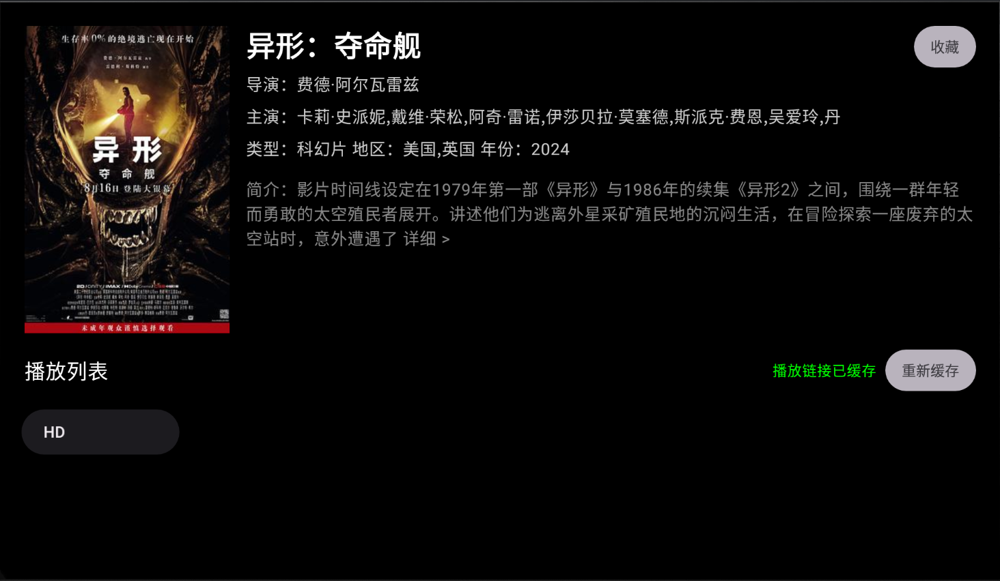

# 简片 (JianPian)

简片是一款简洁的安卓电视/机顶盒视频播放应用，为您提供流畅的观影体验。

## 应用截图

  
  
  
  

## 主要功能

### 🎬 影视浏览
- 最近热播：实时更新的热门影视内容
- 分类浏览：电影、电视剧、综艺、动漫等多种类型
- 智能搜索：快速找到想看的影视内容

### 📺 播放功能
- 高清播放：支持多种清晰度
- 记忆播放：自动记住上次观看位置
- 连续播放：自动播放下一集
- 快进快退：支持进度调节

### 💫 个性化功能
- 播放历史：记录您的观看记录，随时继续观看
- 我的收藏：收藏喜欢的影视内容
- 一键清理：支持清空历史记录和收藏

### 📱 操作体验
- 遥控器优化：完美适配电视遥控器操作
- 简洁界面：干净清爽的用户界面
- 快捷操作：支持长按菜单等便捷功能

## 系统要求
- Android 9.0 (API 28) 及以上版本
- 支持Android TV设备
- 需要网络连接

## 隐私说明
本应用不会收集任何个人信息，所有数据均存储在本地。

## 免责声明
本应用仅提供影视信息浏览和播放服务，所有内容均来自网络。如有侵权，请联系我们删除。 